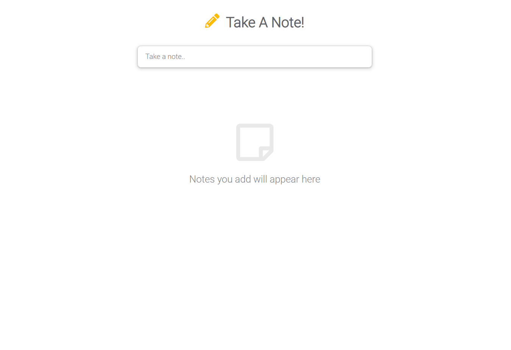

# Take A Note (Google Keep Clone)
A pure JavaScript project inspired by Google Keep.

## Technologies Used

- HTML5
- CSS3
- JavaScript

## Live Demo

Try the application live at [https://malmossa.github.io/Take-A-Note/](https://malmossa.github.io/Take-A-Note)

## Features

- Add a note with title. 
- Choose deferent color for an individual note.
- Edite a note.
- Delete a note. 
- All notes are stored in local storage.

## Preview

